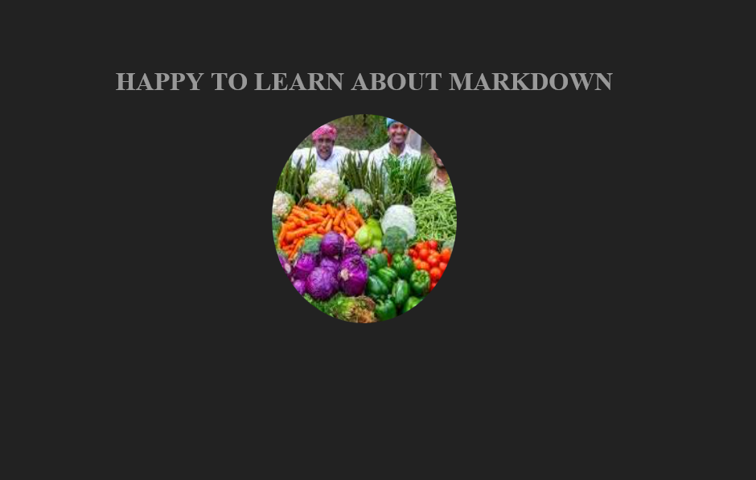

# A SIMPLE WEBSITE ABOUT MY PROFILE🖐
## A simple website showcasing my profile as a developer


Lorem, ipsum dolor sit amet consectetur adipisicing elit. 
    Odio facilis iste veritatis cumque ex dignissimos commodi.
     Totam itaque eveniet labore harum earum fuga dolores sunt,
      incidunt consequuntur esse sint pariatur quod aliquam non atque ducimus placeat rerum velit veniam vero.
     Necessitatibus eos cum distinctio temporibus!

 ## How to run this project <mark>locally</mark>🎅

 this is text is __bold__ text

 this text is  *italics*

 this project is like H<sub>2</sub>o in chemistry ,you cannot do without it and growing like the  function e<sub>x</sub>in mathematics

 <!-- mutiple consecutive  blank lines  -->

 please i want to edit the footer but not the ~~navbar~~

 ```js
 const x=4;
 const y=3;
 console.log(x+y);


 ```
 ## PYTHON CODE NOW
 ```python
 def calculate(x,+y);
  return x+y
  ```
  ## Find me 😶
  [linkedin](https://linkedin.com)

[linkedin](https://linkedin.com)

[linkedin](https://linkedin.com)

## project screenshot📷


